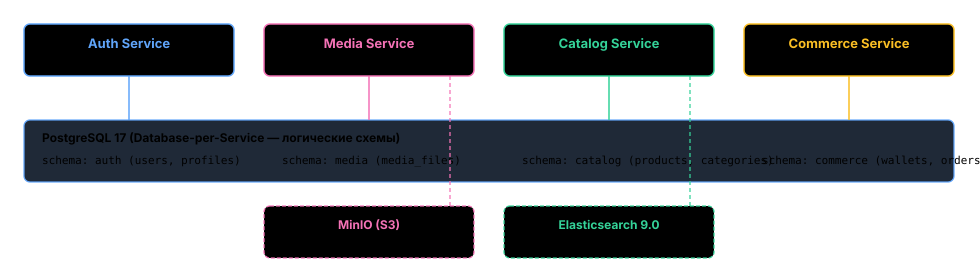

# Модель данных и ER-диаграммы микросервисов — Мобильный маркетплейс

**Проект:** Мобильный маркетплейс (Т-Образование, JDEPH-93)  
**База данных:** PostgreSQL 16+ (Архитектурный паттерн *Database-per-Service* на уровне логических схем: `auth`, `media`, `catalog`, `commerce`)  
**Первичные ключи:** `UUID` (исключает коллизии между распределёнными сервисами и предсказуемый перебор ID)  
**Денежный тип:** `BIGINT` (суммы в бонусах хранятся целыми числами, исключая погрешности чисел с плавающей точкой)  
**Модель ролей:** Отдельные аккаунты для каждой роли (`BUYER`, `SELLER`, `ADMIN`). Одна учётная запись в таблице `users` имеет строго одну роль, определяемую полем `role`.  
**Аутентификация:** 100% Stateless JWT (токены не хранятся в БД, валидируются криптографической подписью).

---

## 1. Схема `auth` (Auth Service)

Отвечает за учётные записи пользователей, аутентификацию (Stateless JWT + HttpOnly cookie) и хранение профилей ролей в связанных таблицах `users`, `buyer_profiles` и `seller_profiles`.

### Структура таблиц схемы `auth`:
- **Таблица `auth.users` (базовый аккаунт):**
  - `id` (PK, UUID)
  - `email` (UK, VARCHAR(255))
  - `password_hash` (VARCHAR(255))
  - `role` (ENUM: `BUYER`, `SELLER`, `ADMIN`)
  - `department` (VARCHAR(255), для `ADMIN`)
  - `created_at`, `updated_at` (TIMESTAMPTZ)
- **Таблица `auth.buyer_profiles` (профиль покупателя, 1:1 к users):**
  - `id` (PK, UUID)
  - `user_id` (FK, UK, UUID) — ссылка на `auth.users(id)`
  - `full_name` (VARCHAR(255), опционально)
  - `phone` (VARCHAR(50), опционально)
  - `created_at`, `updated_at` (TIMESTAMPTZ)
- **Таблица `auth.seller_profiles` (профиль продавца, 1:1 к users):**
  - `id` (PK, UUID)
  - `user_id` (FK, UK, UUID) — ссылка на `auth.users(id)`
  - `company_name` (VARCHAR(255), not null)
  - `inn` (UK, VARCHAR(12), not null, 10 или 12 цифр, неизменяемый)
  - `description` (TEXT, опционально)
  - `created_at`, `updated_at` (TIMESTAMPTZ)

### Ключевые особенности схемы `auth`:
- **100% Stateless JWT:** Сервер не хранит сессии или токены в базе данных. Выпуск и проверка `accessToken` и `refreshToken` происходят исключительно по криптографической подписи.
- **Раздельные аккаунты:** Покупатель и продавец заводят отдельные аккаунты с разными email. Продавец не может оформлять заказы от аккаунта мерчанта (нет роли `BUYER`), что исключает риск непреднамеренной самопокупки.
- **US-1.2:** Поле `inn` валидируется форматом 10 или 12 цифр и защищено от изменения после регистрации.
- **Безопасность (PR-05):** Роль `ADMIN` не выдаётся при публичной регистрации; администраторы создаются служебной миграцией в базе данных.
- **Logout:** При выходе (`POST /auth/logout`) сервер сбрасывает куку в браузере (`Set-Cookie: refreshToken=; Max-Age=0; Path=/api/v1/auth; HttpOnly`), а клиент зануляет `accessToken` в памяти.

---

## 2. Схема `media` (Media Service)

Изолированное хранилище метаданных файлов. Поддерживает паттерн прямой загрузки в MinIO через **Presigned URLs** (бэкенд не нагружается бинарным трафиком).

### Жизненный цикл медиафайла:
- **`PENDING`:** Выдана ссылка `uploadUrl` для прямого `PUT` клиентом в MinIO (TTL ссылки 15 минут).
- **`CONFIRMED`:** Клиент вызвал `POST /api/v1/media/{id}/confirm`, сервис проверил наличие файла в S3 (`HeadObject`) и подтвердил готовность к использованию в карточке товара.

---

## 3. Схема `catalog` (Catalog & Search Service)

Каталог товаров с иерархическим деревом категорий (табы витрины из Figma), медиа-галереей и полнотекстовым поиском.

### Структура таблиц схемы `catalog`:
- **Таблица `catalog.categories` (категории и табы витрины):**
  - `id` (PK, UUID, DEFAULT `gen_random_uuid()`)
  - `parent_id` (FK, UUID, ON DELETE CASCADE) — ссылка на саму себя (`catalog.categories(id)`). Для корневых табов витрины `parent_id IS NULL`, для подкатегорий — UUID родителя
  - `name` (VARCHAR(100), not null) — отображаемое название (например, «Электроника», «Смартфоны»)
  - `slug` (UK, VARCHAR(100), not null) — уникальный URL-friendly идентификатор для фильтрации в каталоге (`?category=electronics`)
  - `sort_order` (INT, not null, DEFAULT 0) — порядок вывода табов в интерфейсе (`ORDER BY sort_order ASC, name ASC`)
  - `is_active` (BOOLEAN, not null, DEFAULT true) — флаг доступности категории на витрине
- **Таблица `catalog.products` (карточки товаров):**
  - `id` (PK, UUID, DEFAULT `gen_random_uuid()`)
  - `seller_id` (FK, UUID, not null) — логическая связь с `auth.seller_profiles(id)`
  - `category_id` (FK, UUID, not null) — ссылка на `catalog.categories(id)`
  - `title` (VARCHAR(255), not null) — наименование товара
  - `description` (TEXT) — подробное описание характеристик
  - `price` (BIGINT, not null) — цена в бонусах (целое число, >= 0)
  - `status` (VARCHAR(50), not null) — жизненный цикл (`ACTIVE`, `HIDDEN`, `ARCHIVED`)
  - `search_vector` (TSVECTOR) — вычисляемый вектор для полнотекстового поиска (Russian FTS + `pg_trgm`)
  - `created_at`, `updated_at` (TIMESTAMPTZ)
- **Таблица `catalog.product_images` (связь товаров с медиафайлами):**
  - `product_id` (PK, FK, UUID) — ссылка на `catalog.products(id)` с каскадным удалением
  - `media_id` (PK, UUID) — логическая связь с `media.media_files(id)`
  - `sort_order` (INT, not null, DEFAULT 0) — порядок показа изображений в карусели

### Ключевые инварианты схемы `catalog`:
- **Иерархия категорий:** Поддерживает древовидную вложенность любой глубины. Корневые табы витрины имеют `parent_id IS NULL`. При удалении категории все дочерние подкатегории удаляются каскадно (`ON DELETE CASCADE`).
- **Связь товаров с категорией:** Каждый товар строго привязан к категории через `category_id` (FK). Исключается появление дублирующих и неструктурированных строковых названий категорий от продавцов.
- **Владелец товара:** Поле `seller_id` ссылается на профиль мерчанта из `auth.seller_profiles`. Только владелец товара имеет право редактировать или переводить его в архив.
- **Полнотекстовый и нечёткий поиск:** Поиск, фильтрация, сортировка и пагинация витрины (`US-2.2`) выполняются через **Elasticsearch** (индекс `products`, анализатор `russian` + `fuzziness: AUTO` по `title^3` и `description`). PostgreSQL остаётся источником истины (Source of Truth) для транзакций, изображений и карточек; в таблице `catalog.products` также сохранены `search_vector` (`GIN`) и `pg_trgm`.
- **Поисковый индекс `products` в Elasticsearch:** Хранит денормализованные поля (`productId`, `sellerId`, `categoryId`, `categorySlug`, `categoryActive`, `status`, `title`, `description`, `price`, `createdAt`) и синхронизируется с PostgreSQL.
- **Видимость на витрине:** Товар доступен для поиска и оформления заказа только при совпадении условий: `products.status = 'ACTIVE'` и активной ветке категорий (`categories.is_active = true`, в индексе ES отражено флагом `categoryActive = true`).

---

## 4. Схема `commerce` (Commerce Service: Cart, Wallet, Orders)

Финансовый контур маркетплейса: кошелёк с журналом транзакций, корзина, заказы со снимками и защита от повторов.

### Защита бизнес-инвариантов в `commerce`:
- **R-14 (Инвариант баланса):** Ограничение `CHECK (balance >= 0)`. Списание/начисление и создание записи в `bonus_transactions` выполняются строго в одной транзакции: `balance = sum(bonus_transactions.amount)`.
- **R-02, US-5.3 AC 5 (Неизменяемость истории):** В `order_items` сохраняются снимки `title_snapshot`, `price_snapshot`, `image_url_snapshot`, а в `orders` — `seller_name_snapshot`. Последующие правки в каталоге не меняют старые чеки.
- **R-06 (Сумма возврата):** При отмене заказа сумма возврата берётся исключительно из `orders.total_amount` (по снимку), а не по текущей цене товара в каталоге.
- **US-3.4 (Защита от удаления товара):** Перед физическим удалением товара проверяется наличие записей в `order_items`. Если товар когда-либо заказывался, удаление блокируется (`409 Conflict`), и товар переводится в `ARCHIVED`.

---

## 5. Общая межсервисная ER-диаграмма

Сводная карта сущностей всех 4 микросервисов, межсервисных логических связей и индекса Elasticsearch:

## 6. Хранилища данных по микросервисам

| Микросервис | Основная БД (Source of Truth) | Дополнительные хранилища |
| --- | --- | --- |
| **Auth Service** | PostgreSQL (схема `auth`) | — |
| **Media Service** | PostgreSQL (схема `media`) | MinIO S3 (бакет `marketplace-media`) |
| **Catalog Service** | PostgreSQL (схема `catalog`) | Elasticsearch 9 (индекс `products` для поиска `US-2.2`) |
| **Commerce Service** | PostgreSQL (схема `commerce`) | — |
